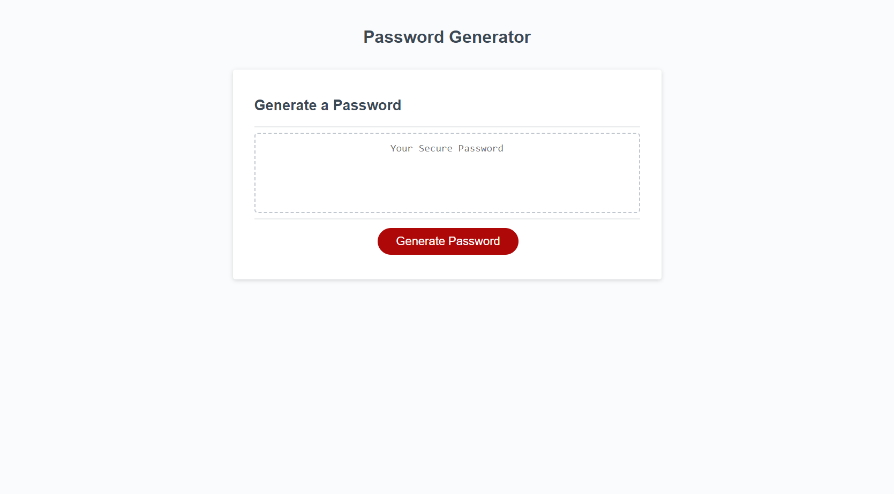

# passwordGenerator

## Description

<!-- Provide a short description explaining the what, why, and how of your project. Use the following questions as a guide: -->

<!-- - What was your motivation? -->
- I wanted to break the bad habit of reusing passwords.
<!-- - Why did you build this project? (Note: the answer is not "Because it was a homework assignment.") -->
- I built this project to generate random unique passwords for various websites.
<!-- - What problem does it solve? -->
- This solves the safety concerns about reusing passwords and makes thinking of a secure password effortless.
<!-- - What did you learn? -->
- I learned how to take in user input and dynamically concatenate only selected fields, run fields through a for loop based on user selected password length, and randomly select characters using Math.random.

## Table of Contents (Optional)

- [Usage](#usage)
- [Credits](#credits)
- [License](#license)

## Usage
https://mwandall.github.io/passwordGenerator/

## Credits

- README template : https://coding-boot-camp.github.io/full-stack/github/professional-readme-guide

## License

MIT License

Copyright (c) [2023] [Mitchell Wandall]

Permission is hereby granted, free of charge, to any person obtaining a copy
of this software and associated documentation files (the "Software"), to deal
in the Software without restriction, including without limitation the rights
to use, copy, modify, merge, publish, distribute, sublicense, and/or sell
copies of the Software, and to permit persons to whom the Software is
furnished to do so, subject to the following conditions:

The above copyright notice and this permission notice shall be included in all
copies or substantial portions of the Software.

THE SOFTWARE IS PROVIDED "AS IS", WITHOUT WARRANTY OF ANY KIND, EXPRESS OR
IMPLIED, INCLUDING BUT NOT LIMITED TO THE WARRANTIES OF MERCHANTABILITY,
FITNESS FOR A PARTICULAR PURPOSE AND NONINFRINGEMENT. IN NO EVENT SHALL THE
AUTHORS OR COPYRIGHT HOLDERS BE LIABLE FOR ANY CLAIM, DAMAGES OR OTHER
LIABILITY, WHETHER IN AN ACTION OF CONTRACT, TORT OR OTHERWISE, ARISING FROM,
OUT OF OR IN CONNECTION WITH THE SOFTWARE OR THE USE OR OTHER DEALINGS IN THE
SOFTWARE.

